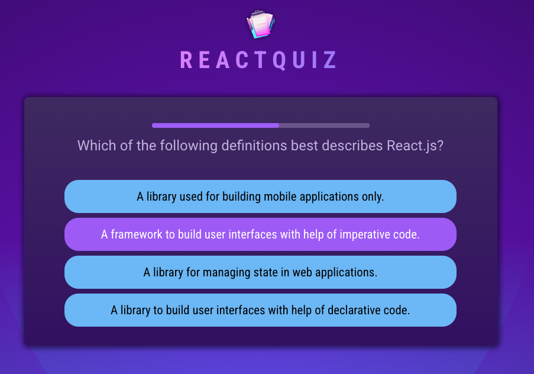
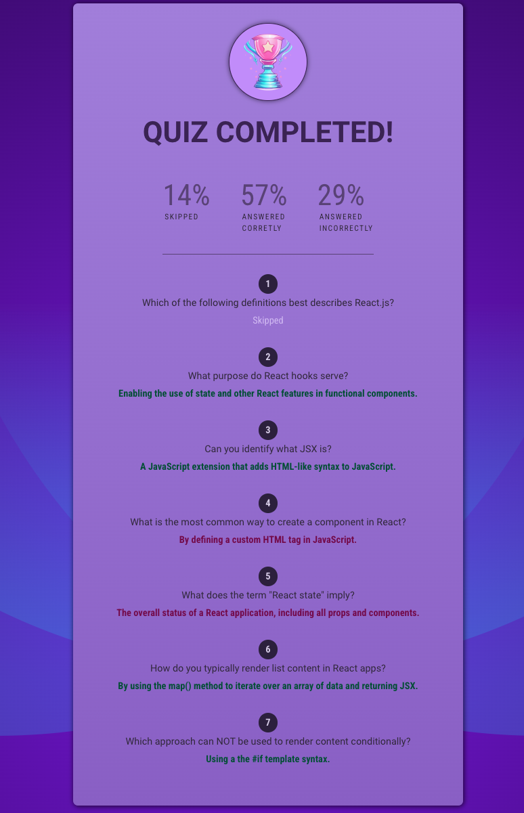

# App Overview

This ReactQuiz allows React developers to refresh their React core concepts by answering to 7 questions. The user can have 15 seconds to answer each question . The remaining time is shown with the progress bar at the top of each question. Each question has 4 answer choices. Once the user selected an answer, the app will be highlighting the selected answer for 1 second before it moves to the next question. The highlighted colors are as follows:

    - YELLOW: when an answer got selected
    - GREEN: when the answer is CORRECT
    - RED: when the answer is WRONG

Once the quiz is completed, the summary of results with correct answers, wrong answers, and skipped answers. It also shows percentage shares of each category of the selected answers.

- Live URL (Hosted with Firebase): https://react-quiz-22bc6.web.app/

## User Story

A React developer wants to test their knowledge about React coree concepts.

## Techniques applied

- Using useEffect hooks for handling side effects
- Using useEffect cleanup functions
- Using Ref to have React store variable value independently from compenent function execution when state changed
- Using React's special prop 'key' to force React to destroy and remount component

## Technologies Used

- React
- JavaScript
- HTML 5
- CSS

Note: I coded along while following React course by Academind @ https://github.com/academind
